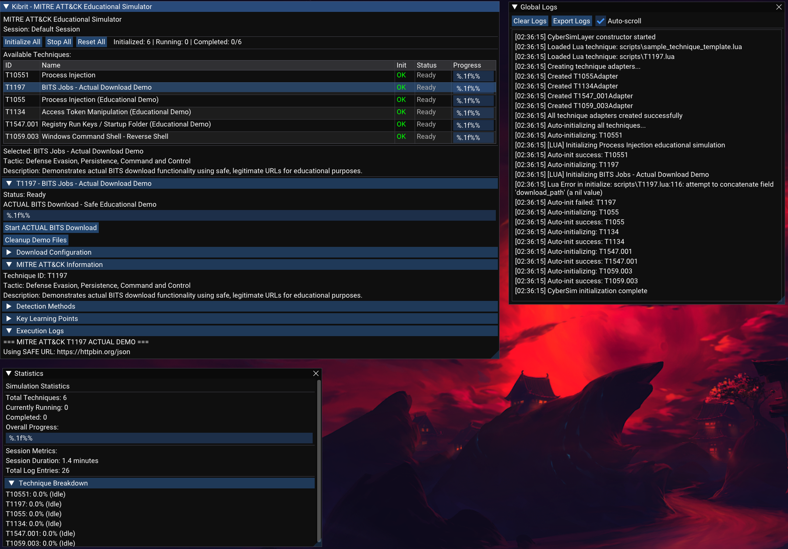

# Kibrit - MITRE ATT&CK Simulator

[](https://www.microsoft.com/windows)

> An open-source educational platform for safely learning and demonstrating MITRE ATT&CK techniques through interactive simulations.

## Overview

Kibrit is a comprehensive simulator designed to help cybersecurity professionals, students, and researchers understand attack techniques from the MITRE ATT&CK framework in a safe, controlled environment. The platform provides interactive demonstrations of various attack techniques while emphasizing defensive strategies and detection methods.

## Showcase



### Elastic Demonstration


### Key Features

- **Safe Learning Environment** - All demonstrations are for simulation purposes
- **MITRE ATT&CK Integration** - Direct mapping to official MITRE ATT&CK techniques and tactics
- **Dual Development Approach** - Contribute via C++ header implementations or Lua scripting
- **Real-time Monitoring** - Live progress tracking, logging, and statistics
- **Session Management** - Save, load, and export simulation sessions
- **Comprehensive Reporting** - Detailed logs and analytics for learning assessment

## Quick Start

### Prerequisites

- Windows 10/11
- Visual Studio 2022
- VULKAN SDK
- LuaJIT
- Git

### Installation

1. **Clone the repository**
   ```bash
   git clone https://github.com/vxintelligence/kibrit.git
   cd kibrit
   ```

2. **Initialize submodules**
   ```bash
   git submodule update --init --recursive
   ```

3. **Build the project**
   ```bash
   # Using Visual Studio
   # Open Kibrit.sln and build in Release mode
   
   # Or using command line
   msbuild Kibrit.sln /p:Configuration=Release
   ```

4. **Run the application**
   ```bash
   ./bin/Release/Kibrit.exe
   ```


## Usage

### Getting Started

1. **Launch Kibrit** and explore the main interface
2. **Select a technique** from the available list
3. **Initialize** the technique to prepare the simulation
4. **Execute** the demonstration to see the technique in action
5. **Review logs** and statistics to understand the technique's behavior

### Interface Overview

- **Techniques Panel** - Browse and select available MITRE ATT&CK techniques
- **Control Panel** - Initialize, execute, and stop simulations
- **Statistics Window** - Real-time progress and performance metrics
- **Logs Window** - Detailed execution logs and educational information
- **Details Panel** - In-depth technique information, mitigations, and detection methods

## Contributing

We welcome contributions from the cybersecurity community! There are two main ways to contribute:

### Method 1: C++ Header Implementation

For developers comfortable with C++, you can implement techniques directly:

1. **Create a new technique header** in `/Techniques/`
2. **Implement the ITechnique interface**:
   ```cpp
   class TechniqueT1234 : public ITechnique {
   public:
       std::string GetID() const override { return "T1234"; }
       std::string GetName() const override { return "Your Technique"; }
       std::string GetTactic() const override { return "Your Tactic"; }
       // ... implement other interface methods
   };
   ```
3. **Add your technique** to the main application
4. **Submit a pull request** with comprehensive documentation

### Method 2: Lua Scripting

The Lua scripting system allows for rapid development and easier contribution. Each Lua technique script must return a table that implements the required interface.

#### Basic Script Structure

Create a Lua file in the `/scripts/` directory with the following structure:

```lua
-- Define the technique table
local technique = {
    -- Required metadata
    info = {
        id = "T1234",                    -- MITRE ATT&CK ID
        name = "Your Technique Name",    -- Human-readable name
        tactic = "Your Tactic",          -- MITRE ATT&CK tactic
        description = "Educational description of the technique",
        author = "Your Name"             -- Script author
    },
    
    -- Technique state management
    state = {
        running = false,        -- Is technique currently executing
        progress = 0.0,         -- Progress from 0.0 to 1.0
        logs = {},             -- Array of log messages
        initialized = false    -- Has technique been initialized
    }
}
```

#### Required Functions

Every technique must implement these core functions:

```lua
-- Initialize the technique (called once)
function technique:initialize()
    self.state.initialized = true
    kibrit.log("Initializing " .. self.info.name)
    
    -- Add your initialization logic here
    -- Return true on success, false on failure
    return true
end

-- Execute the technique demonstration
function technique:execute()
    if not self.state.initialized then
        kibrit.log("ERROR: Technique not initialized")
        return false
    end
    
    self.state.running = true
    self.state.progress = 0.0
    
    -- Your simulation logic here
    for i = 1, 10 do
        kibrit.log("Step " .. i .. " of technique execution")
        self.state.progress = i / 10.0
        kibrit.sleep(100)  -- Simulate work (100ms delay)
    end
    
    self.state.running = false
    self.state.progress = 1.0
    kibrit.log("Technique execution completed")
    return true
end

-- Stop the running technique
function technique:stop()
    self.state.running = false
    kibrit.log("Technique execution stopped")
end

-- Render custom UI for this technique
function technique:render_ui()
    if kibrit.ui.collapsing_header(self.info.name .. " (" .. self.info.id .. ")") then
        -- Status information
        local status = self.state.running and "Running" or 
                      (self.state.progress >= 1.0 and "Complete" or "Ready")
        kibrit.ui.text("Status: " .. status)
        kibrit.ui.text("Progress: " .. string.format("%.1f%%", self.state.progress * 100))
        
        -- Progress bar
        if self.state.progress > 0.0 then
            kibrit.ui.progress_bar(self.state.progress)
        end
        
        -- Control buttons
        if not self.state.running then
            if kibrit.ui.button("Execute Demo") then
                self:execute()
            end
        else
            if kibrit.ui.button("Stop") then
                self:stop()
            end
        end
        
        -- Educational content sections
        if kibrit.ui.collapsing_header("Sub-Techniques") then
            kibrit.ui.text("• List your sub-techniques here")
            kibrit.ui.text("• Each as a separate bullet point")
        end
        
        if kibrit.ui.collapsing_header("Mitigations") then
            kibrit.ui.text("• Describe defensive measures")
            kibrit.ui.text("• Include specific controls and policies")
        end
        
        if kibrit.ui.collapsing_header("Detection Methods") then
            kibrit.ui.text("• Explain how to detect this technique")
            kibrit.ui.text("• Include log sources and indicators")
        end
        
        -- Execution logs
        if kibrit.ui.collapsing_header("Execution Logs") then
            for _, log in ipairs(self.state.logs) do
                kibrit.ui.text("[LOG] " .. log)
            end
        end
    end
end

-- Return the technique table
return technique
```

#### Available Kibrit API Functions

The Lua scripts have access to the following API:

**Logging Functions:**
```lua
kibrit.log(message)           -- Add message to global logs
```

**Utility Functions:**
```lua
kibrit.sleep(milliseconds)    -- Pause execution
kibrit.get_time()            -- Get current time
```

**UI Functions:**
```lua
kibrit.ui.text(text)                    -- Display text
kibrit.ui.button(label)                 -- Create button (returns true if clicked)
kibrit.ui.progress_bar(progress)        -- Show progress bar (0.0 to 1.0)
kibrit.ui.collapsing_header(label)      -- Create collapsible section
```

#### LuaJIT FFI Integration

For advanced technique implementations that require system-level operations, Kibrit supports LuaJIT FFI (Foreign Function Interface). This allows direct access to Windows API functions while maintaining the safety and educational focus of the platform.

**Basic FFI Setup:**
```lua
local ffi = require("ffi")

-- Define C structures and functions
ffi.cdef[[
    // Windows API definitions
    typedef void* HANDLE;
    typedef unsigned long DWORD;
    typedef int BOOL;
    
    // Process management
    HANDLE GetCurrentProcess();
    DWORD GetCurrentProcessId();
    BOOL CloseHandle(HANDLE hObject);
    
    // Memory management
    void* VirtualAlloc(void* lpAddress, size_t dwSize, DWORD flAllocationType, DWORD flProtect);
    BOOL VirtualFree(void* lpAddress, size_t dwSize, DWORD dwFreeType);
]]

-- Load Windows kernel32.dll
local kernel32 = ffi.load("kernel32")
```

**Safe System Interaction Examples:**
```lua
-- Example: Process enumeration for educational demonstration
local technique_with_ffi = {
    info = {
        id = "T1057",
        name = "Process Discovery",
        tactic = "Discovery",
        description = "Educational demonstration of process enumeration techniques"
    }
}

function technique_with_ffi:demonstrate_process_discovery()
    local ffi = require("ffi")
    
    -- Define necessary structures
    ffi.cdef[[
        typedef struct {
            DWORD dwSize;
            DWORD cntUsage;
            DWORD th32ProcessID;
            DWORD th32DefaultHeapID;
            DWORD th32ModuleID;
            DWORD cntThreads;
            DWORD th32ParentProcessID;
            long pcPriClassBase;
            DWORD dwFlags;
            char szExeFile[260];
        } PROCESSENTRY32;
        
        HANDLE CreateToolhelp32Snapshot(DWORD dwFlags, DWORD th32ProcessID);
        BOOL Process32First(HANDLE hSnapshot, PROCESSENTRY32* lppe);
        BOOL Process32Next(HANDLE hSnapshot, PROCESSENTRY32* lppe);
    ```
    
    local kernel32 = ffi.load("kernel32")
    local TH32CS_SNAPPROCESS = 0x00000002
    
    -- Create process snapshot
    local snapshot = kernel32.CreateToolhelp32Snapshot(TH32CS_SNAPPROCESS, 0)
    
    if snapshot ~= ffi.C.INVALID_HANDLE_VALUE then
        local pe32 = ffi.new("PROCESSENTRY32")
        pe32.dwSize = ffi.sizeof("PROCESSENTRY32")
        
        -- Educational demonstration only - log process discovery
        if kernel32.Process32First(snapshot, pe32) then
            repeat
                local process_name = ffi.string(pe32.szExeFile)
                kibrit.log("Discovered process: " .. process_name .. " (PID: " .. pe32.th32ProcessID .. ")")
                self.state.progress = self.state.progress + 0.1
            until not kernel32.Process32Next(snapshot, pe32)
        end
        
        kernel32.CloseHandle(snapshot)
    end
end
```

**Registry Operations for Educational Purposes:**
```lua
-- Example: Registry persistence demonstration
ffi.cdef[[
    typedef void* HKEY;
    typedef const char* LPCSTR;
    typedef DWORD* LPDWORD;
    
    long RegOpenKeyExA(HKEY hKey, LPCSTR lpSubKey, DWORD ulOptions, DWORD samDesired, HKEY* phkResult);
    long RegQueryValueExA(HKEY hKey, LPCSTR lpValueName, DWORD* lpReserved, DWORD* lpType, 
                         void* lpData, DWORD* lpcbData);
    long RegCloseKey(HKEY hKey);
]]

local advapi32 = ffi.load("advapi32")

function technique:demonstrate_registry_discovery()
    local HKEY_LOCAL_MACHINE = ffi.cast("HKEY", 0x80000002)
    local KEY_READ = 0x20019
    
    local hKey = ffi.new("HKEY[1]")
    local result = advapi32.RegOpenKeyExA(
        HKEY_LOCAL_MACHINE,
        "SOFTWARE\\Microsoft\\Windows\\CurrentVersion\\Run",
        0,
        KEY_READ,
        hKey
    )
    
    if result == 0 then
        kibrit.log("Successfully accessed Run registry key for educational demonstration")
        -- Additional educational logging here
        advapi32.RegCloseKey(hKey[0])
    else
        kibrit.log("Registry access demonstration completed with result: " .. result)
    end
end
```

**Network Simulation with FFI:**
```lua
-- Example: Network communication simulation
ffi.cdef[[
    typedef struct {
        unsigned short sa_family;
        char sa_data[14];
    } SOCKADDR;
    
    typedef struct {
        short sin_family;
        unsigned short sin_port;
        unsigned long sin_addr;
        char sin_zero[8];
    } SOCKADDR_IN;
    
    int WSAStartup(unsigned short wVersionRequested, void* lpWSAData);
    int WSACleanup();
    unsigned long inet_addr(const char* cp);
    unsigned short htons(unsigned short hostshort);
]]

local ws2_32 = ffi.load("ws2_32")

function technique:simulate_network_connection()
    local wsaData = ffi.new("char[?]", 400)  -- WSADATA structure
    
    -- Initialize Winsock for demonstration
    local result = ws2_32.WSAStartup(0x0202, wsaData)
    if result == 0 then
        kibrit.log("Network subsystem initialized for educational demonstration")
        
        -- Simulate connection parameters (no actual connection made)
        local target_ip = "127.0.0.1"  -- Localhost only for safety
        local target_port = 80
        
        kibrit.log("Simulating connection to " .. target_ip .. ":" .. target_port)
        kibrit.log("Educational note: No actual network connection is established")
        
        ws2_32.WSACleanup()
    else
        kibrit.log("Network simulation setup failed with error: " .. result)
    end
end
```

**FFI Safety Guidelines:**

1. **Educational Focus Only** - All FFI operations must be for demonstration purposes
2. **No Destructive Operations** - Never perform actions that could harm the system
3. **Safe Defaults** - Use localhost, temporary files, and non-critical registry paths
4. **Comprehensive Logging** - Log all actions for educational review
5. **Error Handling** - Always include proper error checking and cleanup
6. **Documentation** - Explain the purpose and safety measures of each FFI operation

**FFI Development Best Practices:**
```lua
-- Always wrap FFI operations in protective functions
function technique:safe_ffi_operation()
    local success, result = pcall(function()
        -- Your FFI code here
        return true
    end)
    
    if success then
        kibrit.log("FFI operation completed successfully")
        return result
    else
        kibrit.log("FFI operation failed safely: " .. tostring(result))
        return false
    end
end

-- Clean up resources automatically
function technique:cleanup_resources()
    -- Close handles, free memory, etc.
    if self.allocated_memory then
        ffi.C.VirtualFree(self.allocated_memory, 0, 0x8000)  -- MEM_RELEASE
        self.allocated_memory = nil
    end
end
```

#### Advanced Lua Scripting Examples

**State Management:**
```lua
-- Custom state variables
technique.state.custom_data = {
    target_process = nil,
    injection_method = "CreateRemoteThread",
    payload_size = 0
}

-- State persistence across executions
function technique:save_state()
    -- Save important state information
    local state_data = {
        last_execution = os.time(),
        execution_count = self.state.execution_count or 0
    }
    return state_data
end
```

**Interactive Parameters:**
```lua
-- Add configurable parameters
technique.config = {
    target_ip = "127.0.0.1",
    target_port = 4444,
    delay_ms = 1000
}

-- Render configuration UI
function technique:render_config_ui()
    if kibrit.ui.collapsing_header("Configuration") then
        -- Note: Input fields would need additional API support
        kibrit.ui.text("Target IP: " .. self.config.target_ip)
        kibrit.ui.text("Target Port: " .. self.config.target_port)
    end
end
```

#### Script Development Guidelines

1. **Educational Focus**: Always prioritize learning value over technical complexity
2. **Safety First**: Never implement actual attacks, only educational demonstrations
3. **Documentation**: Include comprehensive comments explaining each step
4. **Error Handling**: Implement proper error checking and user feedback
5. **MITRE Accuracy**: Ensure accurate mapping to MITRE ATT&CK framework
6. **User Experience**: Create intuitive and informative UI elements

#### Testing Your Scripts

Before submitting, test your scripts thoroughly:

1. Place your `.lua` file in the `/scripts/` directory
2. Restart Kibrit to load the new script
3. Verify all functions work correctly
4. Test edge cases and error conditions
5. Ensure UI renders properly
6. Validate educational content accuracy

### Contribution Guidelines

- **Safety First** - All contributions must be educational and safe
- **Documentation** - Include comprehensive documentation and educational content
- **Testing** - Test your implementations thoroughly
- **Code Style** - Follow the existing code style and conventions
- **MITRE Mapping** - Ensure accurate mapping to MITRE ATT&CK framework

## Currently Implemented Techniques

| Technique ID | Name | Tactic | Implementation |
|--------------|------|---------|----------------|
| T1055 | Process Injection | Defense Evasion | C++ Header |
| T1134 | Access Token Manipulation | Defense Evasion, Privilege Escalation | C++ Header |
| T1547.001 | Registry Run Keys / Startup Folder | Persistence | C++ Header |
| T1059.003 | Windows Command Shell | Execution | C++ Header |
| T1197 | BITS download functionality | Defense Evasion, Persistence, Command and Control | LUA Script |

## Architecture

### Core Components

- **ITechnique Interface** - Base interface for all attack technique implementations
- **CyberSimLayer** - Main application layer handling UI and technique management
- **LuaBridge** - Integration layer for Lua scripting support
- **Technique Adapters** - Wrapper classes for consistent interface implementation

## Features in Detail

### Educational Focus
- **Mitigation Strategies** - Learn how to defend against each technique
- **Detection Methods** - Understand how to identify these techniques in real environments
- **Sub-technique Coverage** - Comprehensive coverage of technique variations
- **Real-world Context** - Understand when and how these techniques are used

### Session Management
- **Save/Load Sessions** - Preserve your learning progress
- **Export Capabilities** - Generate reports for educational assessment
- **Statistics Tracking** - Monitor learning progress and technique coverage


## Community

### Getting Help
- **Issues** - Report bugs or request features via [GitHub Issues](https://github.com/vxintelligence/kibrit/issues)
- **Discussions** - Join community discussions in [GitHub Discussions](https://github.com/vxintelligence/kibrit/discussions)
- **Contact** - Reach out to the maintainers for collaboration opportunities

### Recognition
We maintain a [Contributors Hall of Fame](CONTRIBUTORS.md) to recognize community members who help improve Kibrit.

## Legal and Ethics

### Important Disclaimers
- **Educational Purpose Only** - This tool is designed solely for educational purposes
- **No Actual Attacks** - All demonstrations are simulations and perform no real attacks
- **Responsible Use** - Users are responsible for using this tool ethically and legally
- **Not for Malicious Use** - Any malicious use of knowledge gained is strictly prohibited

### Security Considerations
- All simulations run in isolated environments
- No actual system modifications are performed
- Network communications are simulated, not real
- Comprehensive logging for educational review

## License

This project is licensed under the Kibrit Non-Commercial Educational License - see the [LICENSE](LICENSE) file for details.

**Note: This software is for educational and research purposes only. Commercial use is prohibited.**

## Acknowledgments

- **MITRE Corporation** - For the comprehensive ATT&CK framework
- **Community Contributors** - For their valuable techniques and improvements

## Additional Resources

- [MITRE ATT&CK Framework](https://attack.mitre.org/)
- [Cybersecurity Education Best Practices](https://www.nist.gov/itl/applied-cybersecurity/nice/resources)

---

**Made with care by the cybersecurity community for educational advancement**

*Remember: We try hard to make it vulnerable and secure it again <3*
